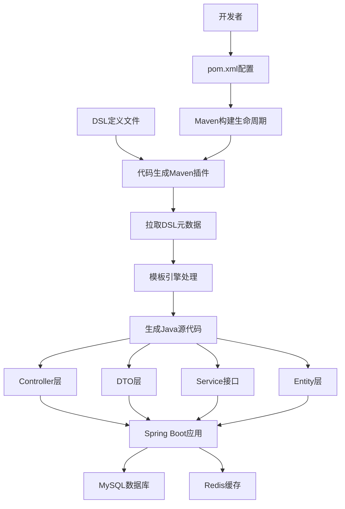

## 项目架构

```mermaid

    graph TB
        A[DSL定义文件] --> B[代码生成Maven插件]
        B --> C[拉取DSL元数据]
        C --> D[模板引擎处理]
        D --> E[生成Java源代码]
        E --> F[Controller层]
        E --> G[DTO层]
        E --> H[Service接口]
        E --> I[Entity层]
        F --> J[Spring Boot应用]
        G --> J
        H --> J
        I --> J
        J --> K[MySQL数据库]
        J --> L[Redis缓存]
        M[开发者] --> N[pom.xml配置]
        N --> O[Maven构建生命周期]
        O --> B
```
