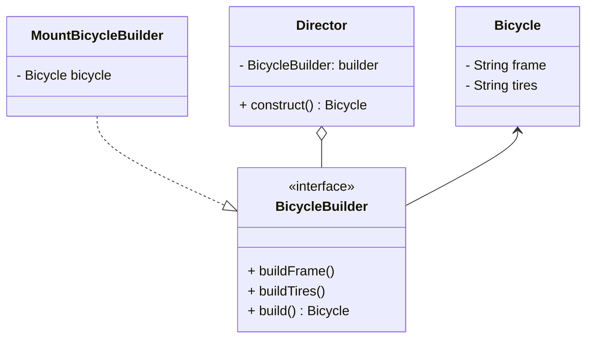

### 需求描述

小明家新开了一家自行车工厂，用于使用自行车配件（车架 frame 和车轮 tires ）进行组装定制不同的自行车，包括山地车和公路车。

山地车使用的是Aluminum Frame（铝制车架）和 Knobby Tires（可抓地轮胎），公路车使用的是 Carbon Frame （碳车架）和 Slim Tries。

现在它收到了一笔订单，要求定制一批自行车，请你使用【建造者模式】告诉小明这笔订单需要使用那些自行车配置吧。

