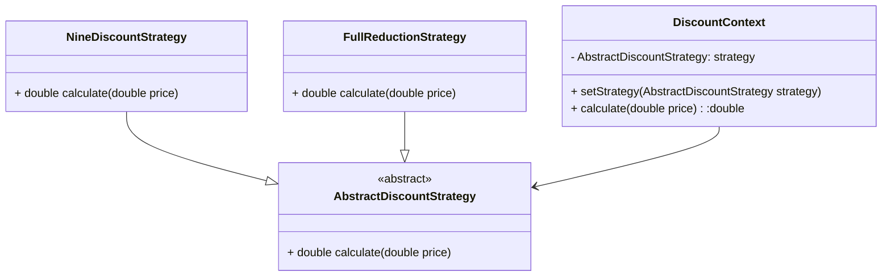

### 需求描述

小明家的超市推出了不同的购物优惠策略，你可以根据自己的需求选择不同的优惠方式。其中，有两种主要的优惠策略：

1. 九折优惠策略：原价的90%。

2. 满减优惠策略：购物满一定金额时，可以享受相应的减免优惠。

具体的满减规则如下：

满100元减5元

满150元减15元

满200元减25元

满300元减40元

请你设计一个购物优惠系统，用户输入商品的原价和选择的优惠策略编号，系统输出计算后的价格。

